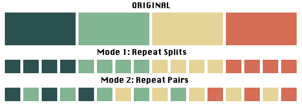

# Shadowing Practice Scripts

These scripts facilitate the creation of audio and video samples for language shadowing practice. Mastering a new piece of shadowing content can be tricky when starting from scratch but it's much easier when broken down into manageable steps:

1. **Divide the audio into segments (splits)**
2. **Practice each segment individually**
3. **Practice the transitions between segments**
4. **Practice the entire sample**

The purpose of these scripts is to automate the creation of practice audio and video clips that guide you through these steps. The audio will play in a structured order to help you master each segment and transition smoothly to the next. The videos created by this tool are ideal to put on your phone especially if you have a video player app that will rewind 10 seconds by left tapping the screen (vlc will do this).

<p align="center">
  
</p>


## Requirements

- **Python**: [Download and install Python](https://www.python.org/downloads/).
- **FFmpeg** (optional, required only for video creation): [Download and install FFmpeg](https://ffmpeg.org/download.html).
- **Audacity**: [Download and install Audacity](https://www.audacityteam.org/download/).

## Setup

1. **Clone the repository:**
```sh
git clone https://github.com/ethDreamer/shadow_tools
cd shadow_tools
```

2. **Set up a virtual environment:**
```sh
python -m venv venv
source venv/bin/activate  # On Windows, use `venv\Scripts\activate`
```

3. **Install dependencies:**
```sh
pip install -r requirements.txt
```

Note: If you want to create videos, you need to install FFmpeg. Follow the [FFmpeg installation instructions](https://ffmpeg.org/download.html).

## Basic Usage

### Step 1: Generate Timestamps with Audacity

### Open Your Audio File in Audacity:

1. Open Audacity.
2. Go to File > Open and select your audio file.

### Play and Identify Split Points:

1. Play the audio and listen carefully to identify where you want to split the audio into chunks (splits).
2. You can use the Spacebar to play/pause and Left Arrow/Right Arrow keys to move back and forth in the audio.

### Add Labels at Split Points:

1. Click on the waveform at the point where you want to split the audio.
2. Go to Edit > Labels > Add Label at Selection (or press `Ctrl+B` on Windows or `Cmd+B` on Mac).
3. A label track will appear below the waveform. Type a short description or just press Enter to create the label.
4. Repeat this process for each split point. Each label marks the beginning of a new chunk.

### Export the Labels:

1. Once you have labeled all your split points, ensure the labels track is selected, then go to File > Export > Export Labels.
2. Save the label file to whatever name you'd like (e.g. `splits.txt`).

### Step 2: Create Audio and Video Samples

To create both audio and video samples, use the `shadow.py` script.

```sh
python shadow.py <audio_file> <timestamps_file> <image_path> --audio_output_file <audio_output_file> --video_output_file <video_output_file> --repeat_count <count> --min_time <seconds> --mode <1|2> --resolution <resolution>
```

Note: When choosing the duration for repeating splits, a min_time value of 21 or 31 seconds tends to work well. This allows you to easily repeat the entire segment by tapping the left side of your phone screen a few times.

- `audio_file`: Path to the input audio file (optional if output audio file already exists).
- `timestamps_file`: Path to the file with timestamps.
- `image_path`: Path to the input image file.
- `--audio_output_file <audio_output_file>`: Path to save the output audio file (default: `single.mp3` or `pairs.mp3`).
- `--video_output_file <video_output_file>`: Path to save the output video file (default: `single<resolution>.mp4` or `pairs<resolution>.mp4`).
- `--repeat_count <count>`: Number of repetitions for each chunk (optional, specify either this or `--min_time`).
- `--min_time <seconds>`: Minimum time (in seconds) for each chunk (optional, specify either this or `--repeat_count`).
- `--mode <1|2>`: Mode for repeating (1 for each split, 2 for split pairs).
- `--resolution <resolution>`: Desired video resolution (e.g., `1920x1080`, `1280x720`, or `native`).

## Additional Scripts

### Create Audio Samples Only

To create only audio samples for shadowing practice, use the `audio_creation.py` script.

```sh
python audio_creation.py <audio_file> <timestamps_file> <output_file> --repeat_count <count> --min_time <seconds> --mode <1|2>
```

- `audio_file`: Path to the input audio file.
- `timestamps_file`: Path to the file with timestamps.
- `output_file`: Path to save the output audio file.
- `--repeat_count <count>`: Number of repetitions for each chunk (optional, specify either this or `--min_time`).
- `--min_time <seconds>`: Minimum time (in seconds) for each chunk (optional, specify either this or `--repeat_count`).
- `--mode <1|2>`: Mode for repeating (1 for each split, 2 for split pairs).

### Create Video Samples Only

To create a video sample from an audio clip and a single image, use the `video_creation.py` script.

```sh
python video_creation.py <image_path> <audio_path> <output_path> --resolution <resolution>
```

- `image_path`: Path to the input image file.
- `audio_path`: Path to the input audio file.
- `output_path`: Path to the output video file.
- `--resolution <resolution>`: Desired video resolution (e.g., `1920x1080`, `1280x720`, or `native`).

## License

This project is licensed under the MIT License. See the [LICENSE](LICENSE) file for details.
